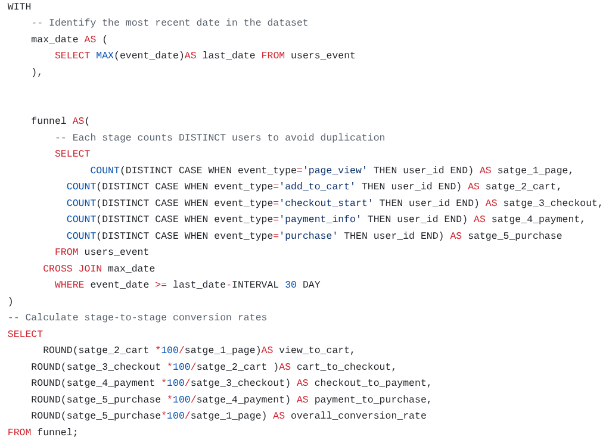
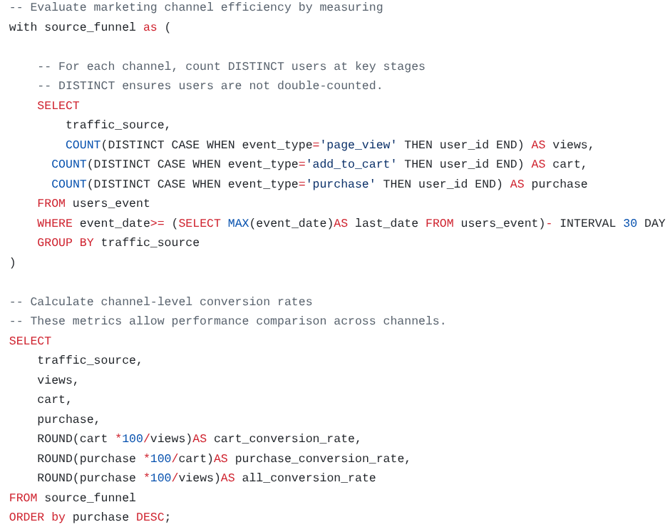
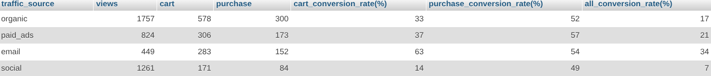

## E-commerce Funnel & Marketing Performance Analysis (SQL)

### ***Objectives***

Analyze the user behavior and marketing efficiency over 30 days to evaluate conversion performance and revenue impact.

### ***🛠 Tools***

- MySQL
- Event-based ecommerce dataset

### ***Business Questions***

- Where do users drop off in the funnel?
- Which traffic source generates the highest conversion rate?
- What is the average time to purchase?
- What is the Average Order Value (AOV)?

### ***Key Metrics Calculated***

. Funnel conversion rates
. Traffic source efficiency
. Average time from view → cart → purchase
. AOV
. Revenue per buyer
. Revenue per visitor

### ***Key Insights***

- Checkout flow shows high completion rate (~80%)
- Social media drives volume but low efficiency
- Email has strongest conversion rate
- AOV ≈ $107 → CAC must remain low to maintain profitability

### ***Business Recommendations***

- Avoid redesigning checkout (already optimized)
- Reduce social ad budget
- Increase efforts to obtain email addresses
- Implement an intensive email address collection process to attract traffic from social media sites.

### ***Sample Output***

- Viewers                    : 4,291        
- Buyers                     : 709       
- Total Revenue ($)          : $76,191.82
- Avg. Order Value ($)       : $107.46 
- Revenue per Buyer ($)      : $107.46   
- Revenue per Viewer ($)     : $17.76    
- Avg. Time: View → Cart     : 12.19 min 
- Avg. Time: Cart → Purchase : 10.16 min 
- Avg. Total Journey Time    : 22.34 min 

## 📊 Sample Queries & Results

## 📊 Sample Queries & Results

### Funnel Conversion Rate
<table>
  <tr>
    <td></td>
    <td></td>
  </tr>
  <tr>
    <td align="center"><b>Query</b></td>
    <td align="center"><b>Result</b></td>
  </tr>
</table>

### Traffic Source Efficiency
<table>
  <tr>
    <td></td>
    <td></td>
  </tr>
  <tr>
    <td align="center"><b>Query</b></td>
    <td align="center"><b>Result</b></td>
  </tr>
</table>

### Author

- ***Name :Abdelhak Morhlia*** 
- ***Social Media:*** https://www.linkedin.com/in/abdelhak-morhlia-41366a396/
